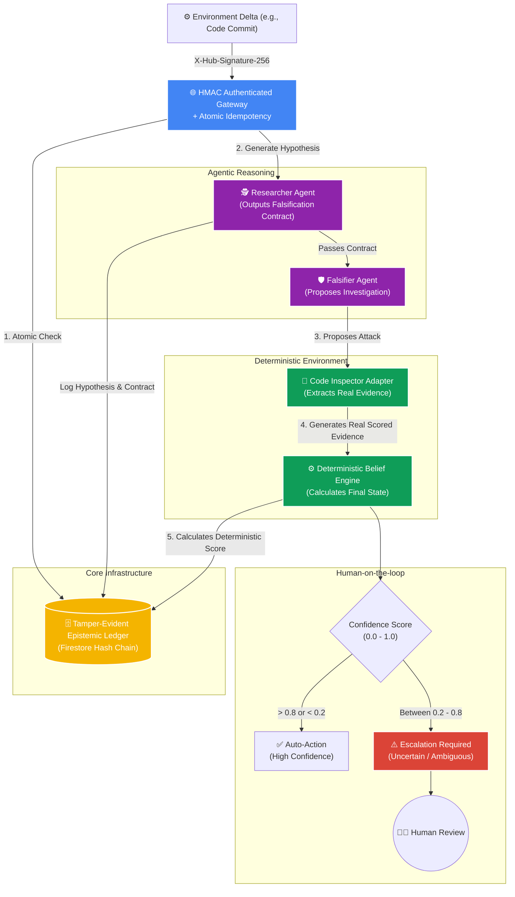

# 🚀 Winjay OS: Agent Reliability Infrastructure
> *"The agents propose. The environment provides evidence. The policy engine decides."*

**Hackathon Track:** Fortified Enterprise Fleet (All Things Agentic Hackathon)

## 📌 The Vision
Most AI agents today operate on a primitive `User Request -> LLM -> Output` loop. They act as chatbots that blindly agree with the user. In an enterprise environment, an agent that hallucinates false confidence is dangerous. 

**Winjay** transforms "Agent Intelligence" into a **production-inspired reliability architecture**. We replace the chatbot model with a strict **Epistemic Architecture**:
- **Falsification Contracts:** Instead of just guessing, the Researcher Agent must define exactly *what would disprove* its hypothesis.
- **Real Deterministic Evidence:** We don't trust LLM hallucinations for evidence. Falsifiers propose an investigation, but actual Python Adapters (e.g., Code Inspector) run the checks and output deterministic scores (-3 to +3).
- **Deterministic Belief Engine:** We stripped the LLM of its authority to make final decisions. A deterministic policy engine calculates the final epistemic confidence based on the true evidence ledger. 
- **Tamper-Evident Epistemic Ledger:** Uses Google Firestore with Cryptographic Hash Chaining (`previous_hash` + payload = `new_hash`). It creates an unalterable, tamper-evident audit trail of the system's shifting beliefs.
- **Atomic Idempotency & Authenticated Webhooks:** Firestore Transactions prevent race-conditions, and HMAC-SHA256 signatures prevent prompt injection via webhooks.

---

## 🏗️ Architecture Diagram



---

## 🛠️ Tech Stack
- **AI Model:** Gemini 3.5 Flash (via Google AI Studio)
- **Framework:** FastAPI (Python)
- **Database (Memory Bank):** Google Cloud Firestore (Tamper-Evident Hash Chain)
- **Governance:** Deterministic Policy Adapters

---

## 🚀 Spin-up Instructions

### 1. Prerequisites
- Python 3.10+

### 2. Installation
Clone the repository and install dependencies:
```bash
git clone https://github.com/wijaywi/WinjayAgent.git
cd WinjayAgent/backend
pip install -r requirements.txt
```

### 3. Environment Variables
Set your Gemini API Key in your terminal:
**Windows (PowerShell):**
```powershell
$env:GEMINI_API_KEY="YOUR_GEMINI_API_KEY"
```

### 4. Run the Backend
Start the Event-Driven infrastructure:
```bash
uvicorn main:app --host 127.0.0.1 --port 8080
```

### 5. Trigger an Environment Delta
In a separate terminal, simulate a webhook trigger (e.g., a code commit removing a JWT check):
```powershell
$body = @{
    repository = "org/core-auth"
    commit_id = "a1b2c3d4"
    changes = "Removed JWT expiry check from middleware."
} | ConvertTo-Json

Invoke-RestMethod -Uri "http://127.0.0.1:8080/webhook/environment-delta" -Method Post -Body $body -ContentType "application/json"
```

Observe the system reject LLM hallucination and deterministically calculate the epistemic score based on real evidence!
