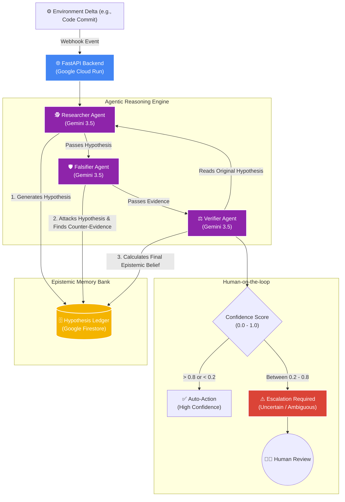

# 🚀 Winjay OS: Agent Reliability Infrastructure

**Hackathon Track:** Fortified Enterprise Fleet (All Things Agentic Hackathon)

## 📌 The Problem
Most AI agents today operate on a primitive `User Request -> LLM -> Output` loop. They are designed to act as chatbots that blindly agree with the user. In an enterprise environment, an agent that hallucinates false confidence is dangerous. 

## 💡 The Solution (Winjay Paradigm)
Winjay transforms "Agent Intelligence" into **Agent Reliability Infrastructure**. We replace the chatbot model with an **Epistemic Architecture**:
- **Continuous Action:** Winjay operates on *Environment Deltas* (e.g., automated webhooks for code commits) rather than waiting for chat prompts.
- **Epistemic Role Separation:** We utilize a multi-agent debate system (Researcher vs. Falsifier) to destroy false hypotheses before they reach production.
- **Uncertainty as a Feature:** Winjay values "I am uncertain" over false confidence, escalating to a human *only* when the epistemic confidence score falls into an ambiguous threshold ("Human-on-the-loop").
- **Institutional Memory:** Uses Google Firestore as a *Hypothesis Ledger* to track beliefs, evidence, and counter-evidence.

---

## 🏗️ Architecture Diagram



---

## 🛠️ Tech Stack
- **AI Model:** Gemini 3.5 Flash (via Google AI Studio / Vertex AI)
- **Framework:** FastAPI (Python)
- **Database (Memory Bank):** Google Cloud Firestore
- **Deployment:** Google Cloud Run

---

## 🚀 Spin-up Instructions (Local Reproduction)

### 1. Prerequisites
- Python 3.10+
- Google Cloud CLI (optional, for Firestore authentication)

### 2. Installation
Clone the repository and install dependencies:
```bash
cd backend
pip install -r requirements.txt
```

### 3. Environment Variables
Set your Gemini API Key in your terminal:
**Windows (PowerShell):**
```powershell
$env:GEMINI_API_KEY="YOUR_GEMINI_API_KEY"
```
**Linux / macOS:**
```bash
export GEMINI_API_KEY="YOUR_GEMINI_API_KEY"
```

### 4. Run the Backend
Start the Event-Driven infrastructure:
```bash
uvicorn main:app --host 127.0.0.1 --port 8080
```

### 5. Trigger an Environment Delta
In a separate terminal, simulate a webhook trigger (e.g., a code commit removing a JWT check) to watch the agents debate in real-time:
```powershell
$body = @{
    repository = "org/core-auth"
    commit_id = "a1b2c3d4"
    changes = "Removed JWT expiry check from middleware."
} | ConvertTo-Json

Invoke-RestMethod -Uri "http://127.0.0.1:8080/webhook/environment-delta" -Method Post -Body $body -ContentType "application/json"
```

Observe the `uncertain` status and confidence scores returned by the Verifier Agent!
