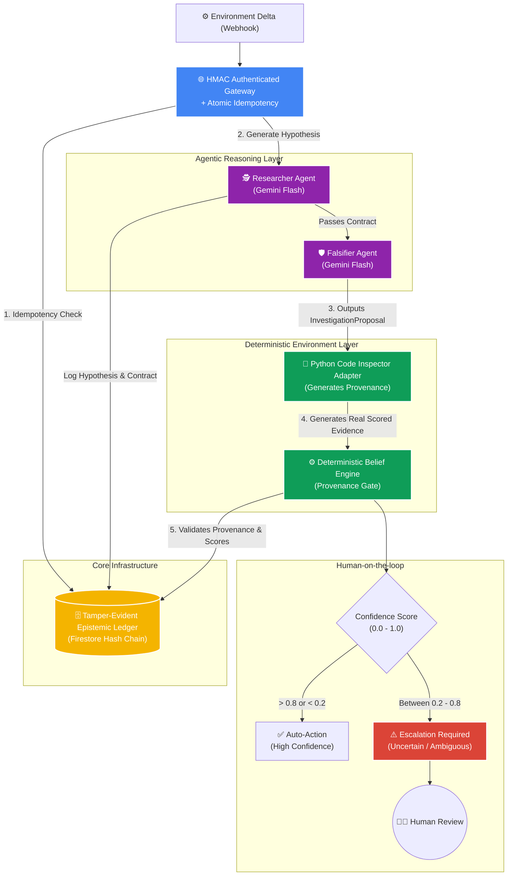

```mermaid
flowchart TD
    %% Styling
    classDef gcp fill:#4285F4,stroke:#fff,stroke-width:2px,color:#fff;
    classDef gemini fill:#8E24AA,stroke:#fff,stroke-width:2px,color:#fff;
    classDef db fill:#F4B400,stroke:#fff,stroke-width:2px,color:#fff;
    classDef alert fill:#DB4437,stroke:#fff,stroke-width:2px,color:#fff;
    classDef engine fill:#0F9D58,stroke:#fff,stroke-width:2px,color:#fff;

    %% Nodes
    Trigger["⚙️ Environment Delta (Webhook)"]
    API["🌐 HMAC Authenticated Gateway<br/>+ Atomic Idempotency"]:::gcp

    subgraph Agentic Reasoning Layer
        R["🕵️ Researcher Agent<br/>(Gemini Flash)"]:::gemini
        F["🛡️ Falsifier Agent<br/>(Gemini Flash)"]:::gemini
    end

    subgraph Deterministic Environment Layer
        ADA["🔌 Python Code Inspector Adapter<br/>(Generates Provenance)"]:::engine
        BE["⚙️ Deterministic Belief Engine<br/>(Provenance Gate)"]:::engine
    end

    subgraph Core Infrastructure
        DB[("🗄️ Tamper-Evident Epistemic Ledger<br/>(Firestore Hash Chain)")]:::db
    end

    subgraph Human-on-the-loop
        Eval{"Confidence Score<br/>(0.0 - 1.0)"}
        ActionAuto["✅ Auto-Action<br/>(High Confidence)"]
        ActionEscalate["⚠️ Escalation Required<br/>(Uncertain / Ambiguous)"]:::alert
        Human(("👨‍💻 Human Review"))
    end

    %% Flow
    Trigger -->|<UNTRUSTED_ENVIRONMENT_DATA>| API
    API -->|1. Idempotency Check| DB
    API -->|2. Generate Hypothesis| R
    
    R -->|Log Hypothesis & Contract| DB
    R -->|Passes Contract| F
    
    F -->|3. Outputs InvestigationProposal| ADA
    ADA -->|4. Generates Real Scored Evidence| BE
    
    BE -->|5. Validates Provenance & Scores| DB
    BE --> Eval
    
    Eval -->|> 0.8 or < 0.2| ActionAuto
    Eval -->|Between 0.2 - 0.8| ActionEscalate
    ActionEscalate --> Human
```
